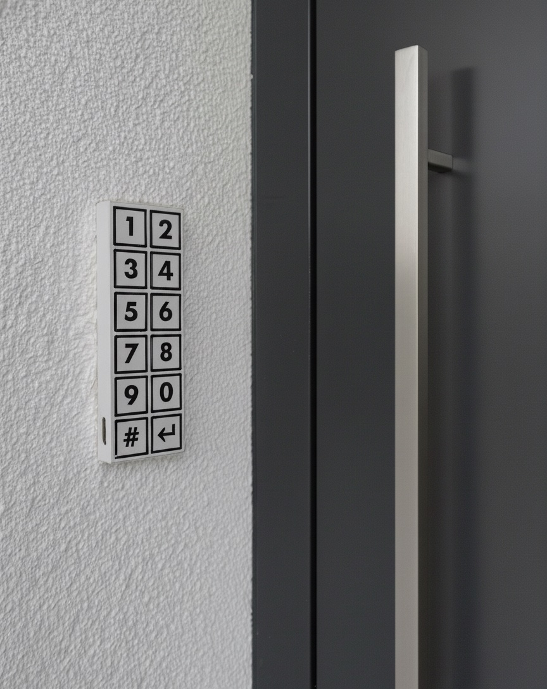

# Zigbee Touch Keypad

I wanted a door keypad that actually looked good on the wall — slim, wireless, no visible screws, no cloud dependency. Something I could mount next to the front door, punch in a code, and have Home Assistant react instantly. Off-the-shelf Zigbee keypads exist, but they're usually expensive, mains-powered, or locked to one ecosystem. So I built my own.

The result is a battery-powered touch keypad about the size of a pez dispenser. It runs for roughly **six months** on a single charge, talks **Zigbee** to whatever coordinator you already run, and wakes from deep sleep the moment you touch a key. This repo has everything you need to build one yourself: Gerber files, a 3D-printable case, and working firmware.

The firmware ships as a **Zigbee** end-device example. The same **ESP32-C6** board is equally happy running **Matter** or **Thread** — the touch handling and power logic stay the same; only the radio stack changes.

---

## What it looks like on the wall

The design goal was something that disappears into a modern entryway. A white slab on textured concrete, twelve touch pads, no mechanical buttons to wear out.

<p align="center">
  
</p>

Early renders explored proportions and mounting position before the first PCB arrived. Getting the aspect ratio right mattered — too tall and it looks like an intercom, too wide and it reads as a light switch.

<p align="center">
  
 </p>

The front panel is a 2×6 grid: digits **1–9**, **0**, a **clear** key, and **enter**. Labels are printed directly on the PCB solder mask — no separate overlay, no glue, nothing to peel off after two winters.

---

## Tear it down

Pop the case apart and the internals are deliberately simple. A custom backplane PCB, a 1300 mAh LiPo filling most of the volume, and an ESP32-C6 dev board at the bottom with a USB-C port for charging and flashing.

<p align="center">
  
</p>

The whole assembly is small enough to hold in one hand. For scale:

<p align="center">
  
  
</p>

Three layers, top to bottom:

1. **Keypad face** — the touch matrix PCB you see and press
2. **Electronics bay** — battery, ESP32-C6, MPR121 touch controller, buzzer
3. **Back cover** — 3D-printed shell (`case_mid_final.stl`) that clips on without screws

The onboard LED sits inside the white case that is somewhat translucent. When the device wakes from deep sleep it glows briefly; each key press flashes it again so you always know your touch registered — even before the buzzer fires.

---

## Order the PCB

You don't need to lay out a board from scratch. The Gerber files are in this repo and ready to upload to any fab. I've been using [JLCPCB](https://jlcpcb.com) — pick a colour scheme, drop in the matching zip, and order. No CAM fixes, no layer renaming, no back-and-forth with support.

| File | Colour scheme |
|------|---------------|
| `touch_matrix_Y24.zip` | **Black on white** — black key labels on a white PCB (latest revision) |
| `touch_matrix_Y23.zip` | **White on black** — white key labels on a black PCB |

Same layout, same touch pads — only the silkscreen colours differ. Choose whichever fits your wall and enclosure.

The back of the PCB carries the JLC order markings and a five-pin header for the MPR121:

| Pin | Function |
|-----|----------|
| GND | Ground |
| INT | Interrupt (wake from sleep) |
| SCL | I²C clock |
| SDA | I²C data |
| 3.3 V | Power |

Solder an [Adafruit MPR121](https://www.adafruit.com/product/1982) breakout to that header, or wire it directly if you prefer.

---

## Wire it up

The firmware expects this pin mapping on the ESP32-C6 DevKitC-1:

| Signal | GPIO | Notes |
|--------|------|-------|
| I²C SDA | 18 | MPR121 data |
| I²C SCL | 4 | MPR121 clock |
| IRQ | 6 | MPR121 interrupt — also the deep-sleep wake source |
| Battery ADC | 2 | Voltage divider input |
| Buzzer | 15 | Short beep on every key press |
| BOOT button | 9 | Hold 3 s for Zigbee factory reset |

The twelve MPR121 channels map to the front-panel keys like this:

| Channel | Key |
|---------|-----|
| 0–8 | 1 – 9 |
| 9 | 0 |
| 10 | Clear |
| 11 | Enter |

Up to eight digits fit in the input buffer.

---

## Flash the firmware

The project builds with [PlatformIO](https://platformio.org/). Clone the repo, connect the ESP32-C6 over USB-C, and:

```bash
pio run --target upload
```

To watch the serial log while pairing:

```bash
pio device monitor
```

The build targets **Zigbee end-device mode** (`ZIGBEE_MODE_ED`) with a custom partition table (`partitions_zigbee.csv`) that reserves flash for Zigbee network storage. Dependencies are pulled automatically — the main one is the Adafruit MPR121 library.

---

## Join your Zigbee network

On first boot the keypad scans for a coordinator. Dots print on the serial console at 115200 baud until it joins. In Home Assistant that means adding it through ZHA or Zigbee2MQTT — the device shows up as manufacturer **DrDoms**, model **KeyPad2**.

Two Zigbee endpoints are exposed:

| Endpoint | Cluster | What it reports |
|----------|---------|-----------------|
| 1 | Analog Input + Battery | Entered passcode, battery voltage |
| 2 | Analog Input | Battery state of charge (%) |

The passcode flow works like this:

1. Touch digits on the pad — the LED confirms each press, the buzzer beeps.
2. Press **Enter**. The code is reported on endpoint 1 as an analog value.
3. Battery level is reported at the same time.
4. Two seconds later the reported value resets to **0**, ready for the next entry.

Press **Clear** at any time to wipe the buffer and start over.

### Matter and Thread

This repo demonstrates Zigbee because it's the fastest path to a working smart-home integration. But the ESP32-C6 has a native 802.15.4 radio, so porting to **Thread** and **Matter** is straightforward — the touch scanning, debouncing, battery ADC, and deep-sleep wake logic in `main.cpp` don't care which protocol sends the numbers upstream. Espressif's [ESP-Matter](https://github.com/espressif/esp-matter) SDK is the place to start if you want to go that route.

---

## Power: six months on a charge

Battery life was the hardest constraint. A keypad that's dead every two weeks is worse than no keypad at all.

The trick is aggressive deep sleep. After ten seconds without a touch, the firmware shuts everything down and puts the MPR121 into its slowest scan rate. The ESP32-C6 draws almost nothing. The next finger on the pad pulls the MPR121 interrupt line low, the MCU wakes, re-initialises I²C, and is ready to scan within milliseconds.

With a 1300 mAh cell and typical use — a few code entries per day — that works out to roughly **half a year** between USB-C charges. Battery voltage and percentage are reported over Zigbee so you can set a low-battery alert in Home Assistant before it goes flat.

---

## Day-to-day use

1. Walk up and touch a key. The LED glows through the case as the device wakes.
2. Enter your code. Each digit beeps and flashes the LED.
3. Press **Enter** to send it to your automation.
4. Walk away. Ten seconds later it sleeps again.

If you need to re-pair — new coordinator, corrupted network, that sort of thing — hold the **BOOT** button for more than three seconds. The device factory-resets its Zigbee stack and reboots.

---

## What's in this repo

```
keypad/
├── main.cpp                  # Touch handling, Zigbee reporting, power management
├── platformio.ini            # Board target, libraries, build flags
├── partitions_zigbee.csv     # Flash layout with Zigbee storage partitions
├── case_mid_final.stl        # 3D-printable enclosure mid-section
├── touch_matrix_Y24.zip      # PCB Gerbers — black on white
├── touch_matrix_Y23.zip      # PCB Gerbers — white on black
└── touch_matrix_*.jpg        # Photos from the build
```

---

## License

| Part | License | File |
|------|---------|------|
| Firmware (`main.cpp`, build config) | [MIT License](LICENSE) | `LICENSE` |
| Hardware (PCB Gerbers, STL, design files) | [CERN Open Hardware Licence v2 — Strongly Reciprocal](LICENSE.hardware) | `LICENSE.hardware` |

It really works well - has been my method of entry for the past year. If you make a variant — Matter port, different key layout, waterproof enclosure — I'd love to see it.
